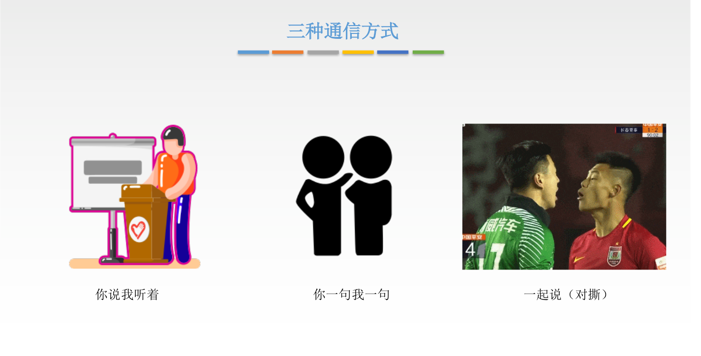
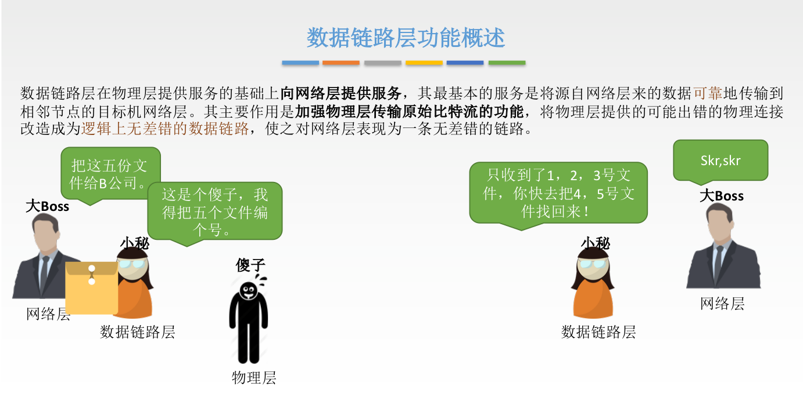
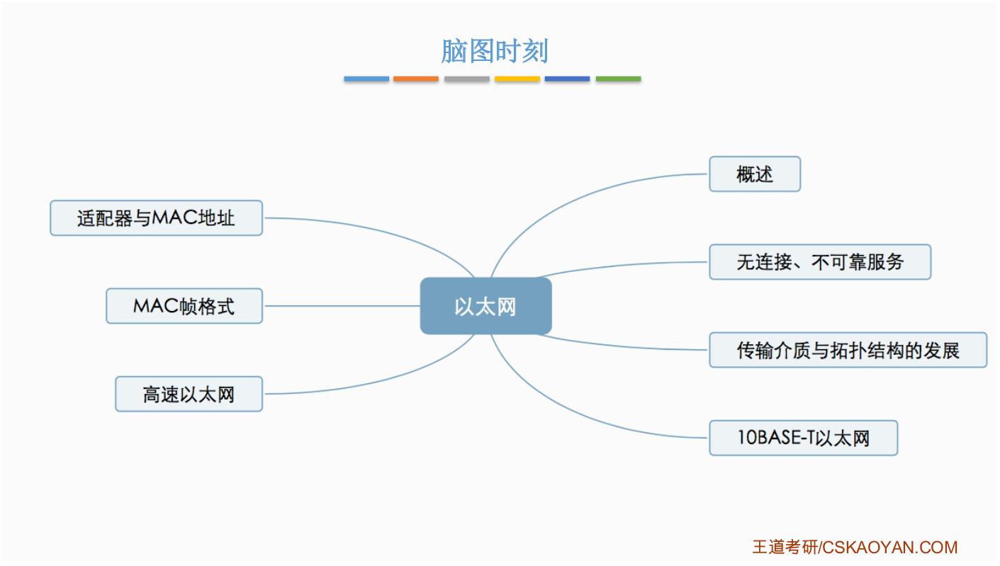
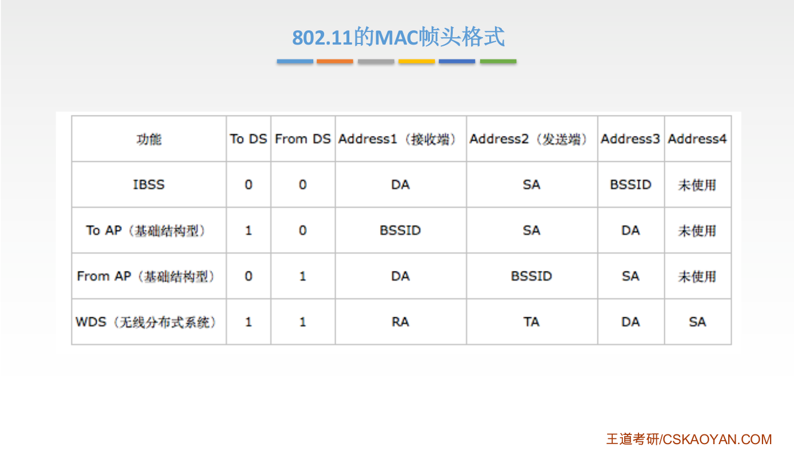
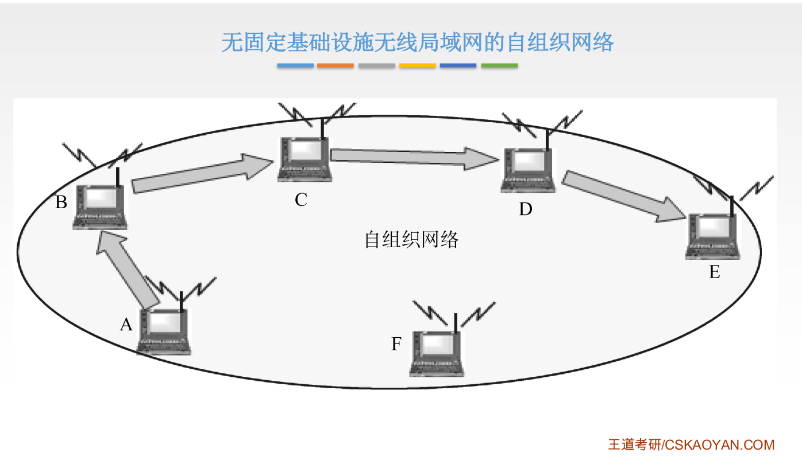
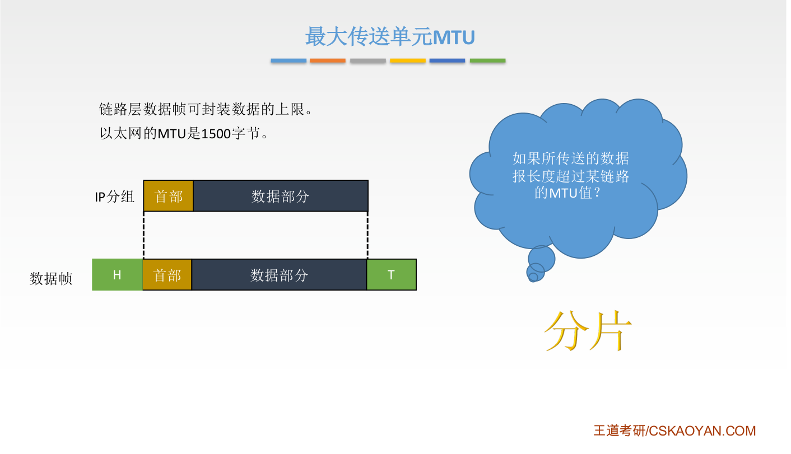
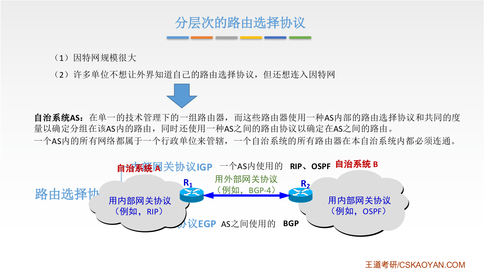

# 计算机网络

## 第一章 计算机网络体系结构

### 1.1 计算机网络的概念

### 1.2 计算机网络的组成

### 1.3 计算机网络的分类

### 1.4 标准化

### 1.5 性能指标

#### 1 速率

#### 2 带宽

#### 3 吞吐量

#### 4 时延

发送时延

传播时延

排队时延、处理时延：路由器

高速链路：提高发送速率，提高带宽，传播速率不变

#### 5 时延带宽积

描述信息量的属性

#### 6 往返时延RTT

#### 7 利用率

### 1.6 分层结构、协议、接口、服务

- 协议：水平方向，对等实体间有协议
- 接口：两层之间
- 服务：上层使用下层服务

服务是单向的

### 1.7 OSI参考模型

中间系统：路由器

中间系统没有上面4层，好像是直接通信，所以是端到端

下面三层只管与下一个中间系统，所以是点对点

数据链路层加了首部和尾部

因为同层协议相同，所以可以去掉首部

#### 应用层

联网才能用的东西

文件传输：FTP

电子邮件：SMTP

万维网：HTTP

#### 表示层

显示

JPEG ASCII

#### 会话层

#### 传输层

每个进程都有一个端口号，端到端

可靠传输：建立链接，确认机制；接收方需要返回确认信息

不可靠传输：

TCP UDP

#### 网络层

网际互联

#### 数据链路层

#### 物理层

### 1.8 TCP、IP参考模型

## 第二章 物理层

### 2.1 物理层概念

### 2.2 数据通信基础知识

通信方式是在确定谁为发送方，谁为接受方

数据在信道上的传输方式

### 2.3 码元、速度、波特、带宽

1 Baud = 1码元/s

### 2.4 奈氏准则、香农定理

### 2.5 编码、调制

### 2.6 物理层传输介质

### 2.7 物理层设备

#### 中继器

衰减信号再生放大

两端是网段、不是子网

不超过5个网段、最多有4个物理层设备、只有三个段可以链接计算机

#### 集线器

集线器：广播

## 第三章 数据链路层

### 3.1 概述

水平发送

### 3.2 封装成帧、透明传输

### 3.3 差错控制

### 3.4 流量控制

### 3.5 介质访问控制

### 3.6 局域网

wifi是wlan的一种

#### 以太网

MAC地址，随着网卡

#### 无线局域网

### 3.7 广域网

### 3.8 链路层设备

#### 网桥、交换机

冲突域：同一区域同一时刻只能一个设备通信

## 第四章 网络层

### 4.1 网络层功能

异构网络互联：路由器

### 4.2 数据交换方式

### 4.3 IP

#### 431 IP数据报格式

数据部分是传输层的

#### 432 IP数据报分片

#### 4.3.3 IPv4

标识主机或路由器

网络号：

主机号：

网络号：222.1.3.0

222.1.1.0

222.1.2.0

一个路由器有多个IP地址，每个接口都有一个IP地址

绿色区域为无编号网络

#### 434 网络地址转换（NAT）

端口号：传输层，标识进程

#### 435 子网划分、子网掩码

所有的145.13.x.x的数据报都会先到达路由器，然后在向下发送，具体发送方法，需要了解子网掩码

子网掩码：网络号1 主机号0

#### 436 五分类编制CIDR

#### 437ARP

#### 438 DHCP

#### 4.3.9 ICMP

### 4.4 IPv6

### 4.5 路由算法与路由协议

### 4.6 ip组播

### 4.7 移动ip

### 4.8 网络层设备

## 第五章 传输层

### 5.1 传输层概述

传输层：进程与进程

网络层：主机与主机

微信聊天一般都是UDP

端口：唯一标识主机中的进程，逻辑端口、软件端口

端口号：动态选择

套接字：主机+进程

### 5.2 UDP

### 5.3 TCP

